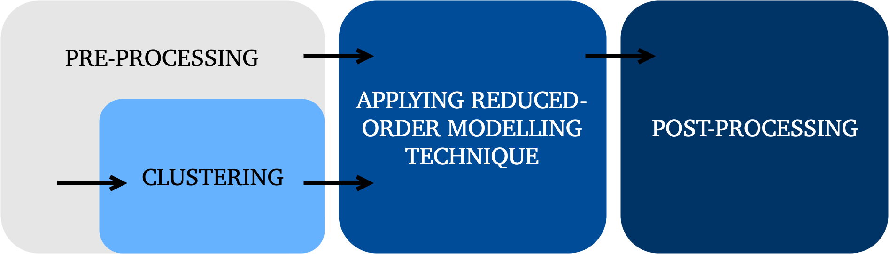

# {: width=30} Reduced-Order Modelling for combustion data sets

This is a collection of Matlab tools for performing a general Reduced-Order Modelling on data sets. Many of the functions presented here can be used universally on data sets coming from various disciplines but the main focus was to apply the techniques to combustion data sets and hence some methods will be combustion-specific.

The general methodology for the usage of functions in this repository is presented on the graph below:

As a general rule, applicable to all functions presented in this repository, the original raw data set `X` has size `n_obs` x `n_vars`, where `n_obs` is the number of observations and `n_vars` is the number of variables. Typically `n_obs` >> `n_vars` and so `n_vars` determines the dimensionality of the problem.

  

## Data pre-processing

#### Centering and scaling

`center()`

`scale()`

`uncenter()`

`unscale()`

## Clustering

#### Finding clusters

`idx_kmeans()`

`idx_mixture_fraction_bins()`

`idx_vector_quantization_pca()`

#### Auxiliary functions

`get_centroids()`

`get_cluster_populations()`

`get_clusters()`

`get_partition()`

`degrade_clusters()`

## Reduced-Order Modelling techniques

#### Feature Assisted Clustering (FAC)

#### Independent Component Analysis (ICA)

#### Kernel methods

#### Kriging

#### Local PCA (LPCA)

`lpca()`

`recover_from_lpca()`

#### Non-negative Matrix Factorization (NMF)

#### Polynomial Chaos Expansion (PCE)

## Data post-processing

#### Quality of reconstruction measurements

`quality_of_reconstruction_measures()`

#### Data operations

`procrustes_analysis()`

`rotate_factors()`
