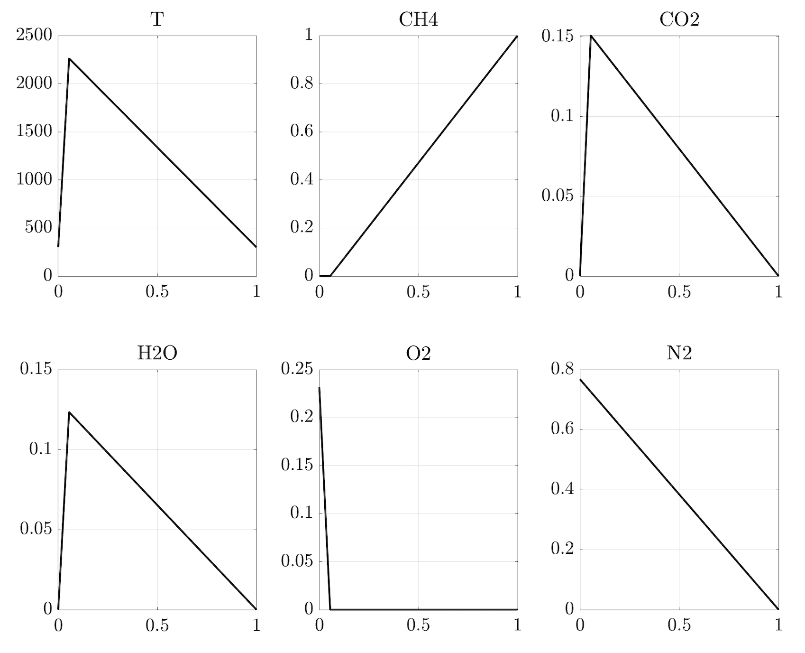

# Combustion data generation

## Burke-Schumann solution

### Methane-air

This function generates a Burke-Schumann solution with `n_points` number of points for a CH4-air flame. The obtained data set can be further fed to ROM techniques.

```matlab
[Z, state_space, state_space_labels, s] = Burke_Schumann_solution_CH4_air(n_points, graph)
```



## Add noise to data

In order to add noise to a data set (such as the B-S solution) use the following function:

```matlab
[X_noised] = add_noise_to_data(X, snr, remove_negative_terms)
```
